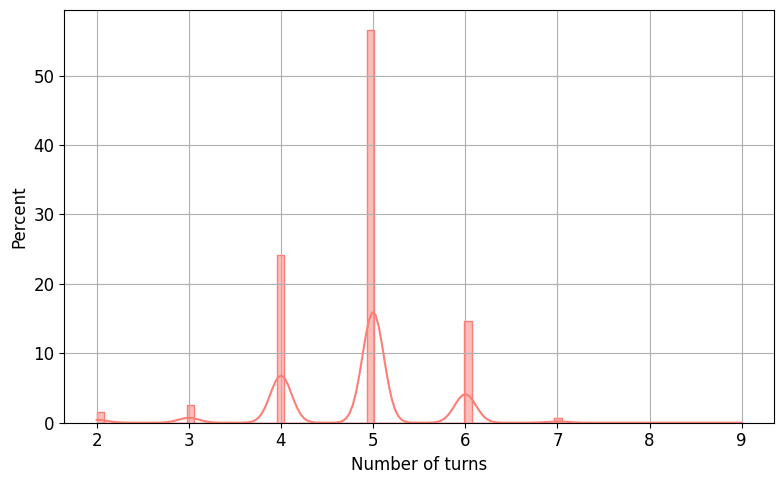
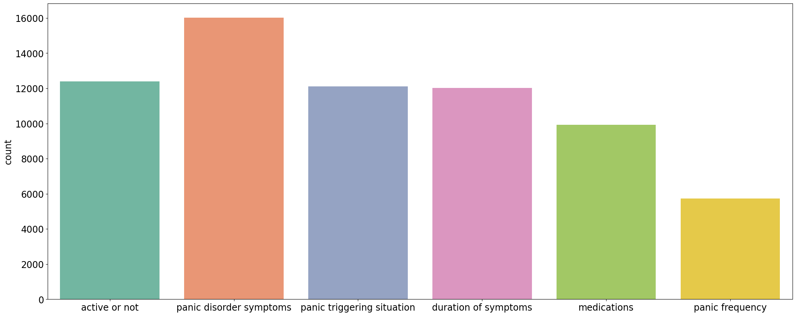
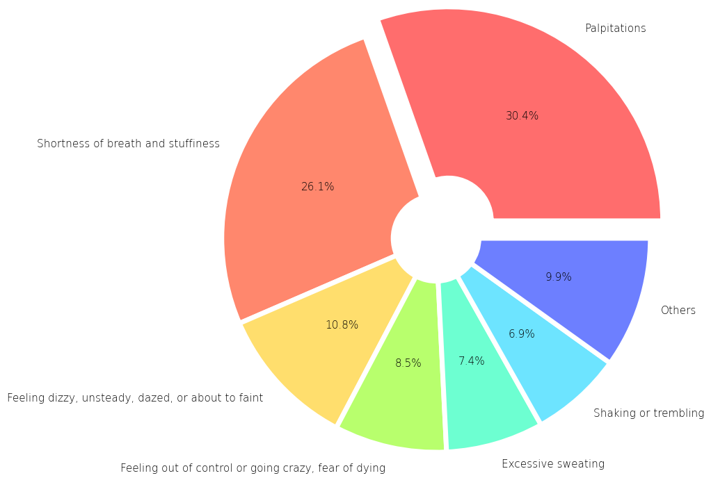

# **Multimodal Task-oriented Dialogue for Psychiatric Counseling**

```bash
.
├── data                            데이터셋 경로
├── prompt                       
│   ├── sample_conversation.json    16개의 fewshot 예시
│   ├── template.py                 시스템 메세지 및 context template 
│   └── __init__.py                                 
│
├── configs/                        
│   └── api.json                    OpenAI API Key 포함                         
├── ...
├── main.py                         MMTOD-PC 데이터셋 구축 실행 코드
├── READMD.md
└── ...
```


## **Framework**

<br>
<div align=center>
<br>
<b>Building MMTOD-PC</b>
</div>
<br>


```bash
# Build dataset
python main.py \ 
    --build_prompt \ 
    --config_file config.json \ 
    --data_dir ./data \ 
    --prompt_dir ./prompt \ 
    --log_path ./log \ 
    --seed 19
```


## **Analysis**

<br>
<div align=left>
<br>
<b>대화 당 턴 개수 분포</b>
</div>
<br>


<br>
<div align=left>
<br>
<b>레이블링된 슬롯 개수 분포</b>
</div>
<br>


<br>
<div align=left>
<br>
<b>공황장애 증상 분포</b>
</div>
<br>


## **DST Baseline**

공황장애 상담 대화 도메인의 Multimodal DST 베이스라인 성능 

|Model|Joint Goal Accuracy (%)|Slot micro F1 (%)|Slot stderr|
|--|--|--|--|
|Baseline|74.188|75.444|0.004|

<br>

GPT-2를 MMTOD-PC 데이터셋에 학습하여 DST 성능 측정
<br>
<div align=left>
<br>
<b>Training GPT-2</b>
</div>
<br>


사용자 얼굴 이미지 캡션을 Visual context로 활용하기 위해 사용한 템플릿  
사용자 메타 데이터를 활용하였음  
<br>
<div align=left>
<br>
<b>이미지 캡션 생성 템플릿</b>
</div>
<br>
